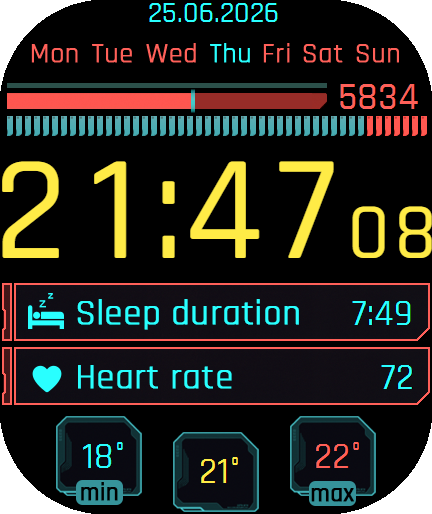

Markdown
# Cyberpunk 2077 Watchface for Amazfit Bip Max

A custom watchface heavily inspired by the UI and HUD elements of Cyberpunk 2077. Designed from scratch to give your smartwatch a clean, dark, and highly functional cyberpunk netrunner look.

## Installation

1. Enable Developer Mode in your Zepp App.
2. Scan the QR code below on your phone to install.

For a detailed step-by-step guide, see the official [Zepp App Documentation](https://docs.zepp.com/docs/guides/tools/zepp-app/).

## Tools Used

This watchface was created using [Watch Face Editor (ZeppOS)](https://apps.microsoft.com/detail/xp89mr7pjvt9q9).
## Porting & Modifications

The project is licensed under the **MIT License**, meaning you are fully welcome to:

- Port this watchface to other smartwatches (like Amazfit Balance, GTR, etc.).
- Modify, tweak, or expand the layout and tracked metrics.
- Share your versions with the community!

## License

This project is open-source and available under the [MIT License](LICENSE).